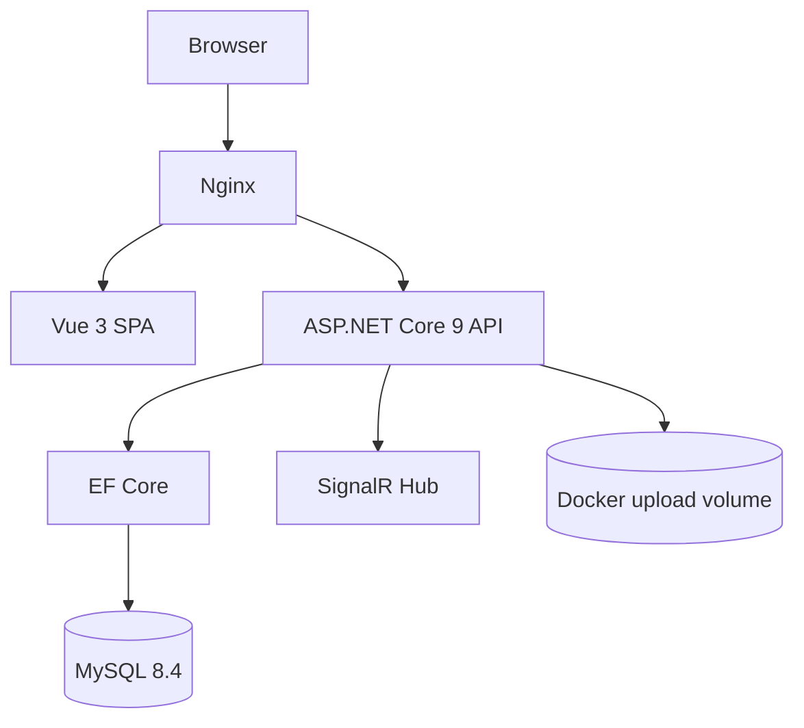

# Kiến trúc

Vue 3/Vite/Pinia/Ant Design Vue gọi ASP.NET Core Web API qua Axios. API dùng JWT Bearer, EF Core/Pomelo và MySQL. Nginx phục vụ frontend và reverse proxy `/api`, `/notificationHub`; SignalR đẩy sự kiện nhưng dữ liệu thông báo gốc nằm trong MySQL.

