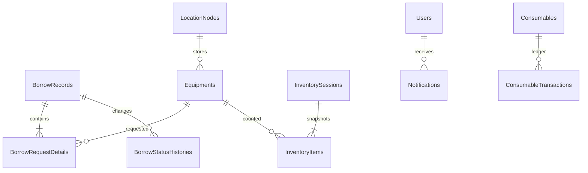

# Mô hình dữ liệu

Các nhóm bảng chính: `Users`, `Equipments`, `AssetCategories`, `LocationNodes`, `BorrowRecords`, `BorrowRequestDetails`, `BorrowStatusHistories`, `MaintenanceRecords`, `Consumables`, `ConsumableRequests`, `ConsumableTransactions`, `InventorySessions`, `InventoryItems`, `Notifications`, `Penalties`, `AuditLogs`.

Migration phải chạy tuần tự bằng `dotnet ef database update` hoặc cơ chế `Database__ApplyMigrations=true`; không sửa schema thủ công trong production.

