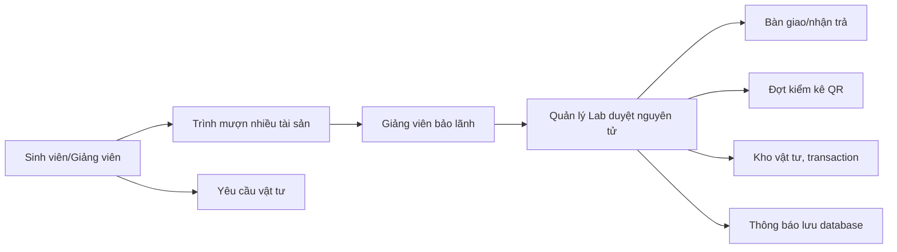

# Use case chính

```mermaid
flowchart LR
  SV[Sinh viên/Giảng viên] --> M[Trình mượn nhiều tài sản]
  M --> GV[Giảng viên bảo lãnh]
  GV --> QL[Quản lý Lab duyệt nguyên tử]
  QL --> BD[Bàn giao/nhận trả]
  QL --> KT[Đợt kiểm kê QR]
  SV --> VT[Yêu cầu vật tư]
  QL --> K[Kho vật tư, transaction]
  QL --> TB[Thông báo lưu database]
```

